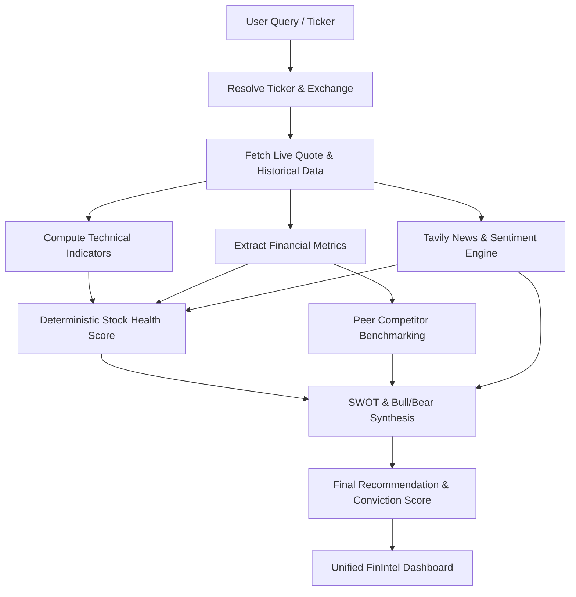

# FinIntel — Autonomous AI Investment Research Agent

<p align="center">
  
  
  
  
  
  
</p>

FinIntel is an institutional-grade, full-stack AI-driven equity research platform designed for Indian (NSE/BSE) and global markets. Powered by multi-step agentic pipelines, deterministic financial algorithms, and real-time market data, FinIntel synthesizes comprehensive investment theses, technical indicators, health scores, and competitor comparisons in seconds — all calibrated and presented in **Indian Rupees (₹)**.

---

## Key Features

- **Autonomous Agentic Research Pipeline**: Orchestrates multi-phase research across ticker resolution, live market data, financial metrics, technical indicators, news sentiment, competitor analysis, and SWOT synthesis.
- **Real-Time Market Data & Broker Integration**: Real-time NSE/BSE price discovery via Groww API integration with fallback to Yahoo Finance.
- **Deterministic Stock Health Score (0–100)**: Transparent, formula-based scoring engine assessing Fundamental, Valuation, Growth, Technical, and Risk health with full reproducibility.
- **Conversational AI Stock Screener**: Natural language query parser that translates prompts (e.g., *"Find Indian IT companies with ROE > 20% and P/E under 30"*) into deterministic mathematical screening filters.
- **Institutional Technical Analysis**: Computes SMA (20/50), EMA, RSI (14), MACD (12, 26, 9), Bollinger Bands, and annualized volatility with automated bias classification (Bullish/Bearish/Neutral).
- **Competitor & Peer Benchmarking**: Side-by-side metric comparisons against top sector peers covering Valuation (P/E, P/B, EV/EBITDA), Profitability (ROE, Operating Margin), and Leverage.
- **Interactive Multi-Timeframe Charts**: Dynamic charting across 1D, 1W, 1M, 3M, 6M, 1Y, 3Y, 5Y, and All timelines with SMA overlays and volume distribution.
- **Strict INR (₹) Currency Normalization**: Real-time currency conversions ensuring all market caps, target prices, and metrics display consistently in INR.
- **Local Research History & Watchlists**: Fast, client-side persistence of previous reports and monitored equities.

---

## Agent Pipeline Architecture



---

## Tech Stack

| Layer | Technologies |
|---|---|
| **Frontend** | Next.js 15 (App Router, Turbopack), React 19, TypeScript, Tailwind CSS, Lucide React, Recharts |
| **Backend** | Node.js, Express, TypeScript, LangChain / LangGraph patterns, SQLite / In-Memory Caching |
| **AI & LLM** | Google Gemini (gemini-2.5 / gemini-3.5) |
| **Market Data & Search** | Groww API, Yahoo Finance API, Tavily Search API |
| **Quality & Testing** | ESLint, TypeScript Compiler (`tsc`), Custom Deterministic Test Suites (`tsx`) |

---

## Project Structure

```text
FinIntel/
├── backend/
│   ├── src/
│   │   ├── agent/             # Multi-step research graph & simulation pipelines
│   │   ├── config/            # Environment and application configurations
│   │   ├── controllers/       # HTTP request handlers
│   │   ├── routes/            # Express API route declarations
│   │   ├── services/          # Market data (Groww/Yahoo), LLM, and calculation services
│   │   ├── tests/             # Unit tests (Technicals, Health Score, Screener, Agent)
│   │   └── utils/             # Math utilities, caching, and currency converters
│   ├── .env.example           # Backend environment template
│   ├── package.json
│   └── tsconfig.json
│
├── frontend/
│   ├── src/
│   │   ├── app/               # Next.js App Router (pages and layouts)
│   │   ├── components/        # React components (Dashboard, Charts, Screener, Tabs)
│   │   ├── context/           # React context providers
│   │   └── lib/               # Client utilities and API client definitions
│   ├── .env.example           # Frontend environment template
│   ├── package.json
│   └── tsconfig.json
│
├── .gitignore                 # Root gitignore protecting secrets and build outputs
└── README.md
```

---

## Getting Started

### Prerequisites

- **Node.js**: v18.17+ or v20+ recommended
- **npm** or **yarn** / **pnpm**
- **Google Gemini API Key**: [Google AI Studio](https://aistudio.google.com/)
- *(Optional)* **Tavily API Key**: [Tavily AI](https://tavily.com/)
- *(Optional)* **Groww API Key**: For direct real-time NSE live feed

### 1. Clone the Repository

```bash
git clone https://github.com/OmGupta03/FinIntel.git
cd FinIntel
```

### 2. Backend Setup

```bash
cd backend
npm install
cp .env.example .env
```

Configure your `.env` file:

```env
PORT=5000
NODE_ENV=development
CORS_ORIGIN=http://localhost:3000

# Required for AI synthesis
GEMINI_API_KEY=your_gemini_api_key_here

# Optional: Enhanced news search (falls back to financial news RSS if omitted)
TAVILY_API_KEY=your_tavily_api_key_here

# Optional: Real-time NSE broker feed
GROWW_API_KEY=your_groww_api_key_here

CACHE_TTL=3600
```

Start the backend development server:

```bash
npm run dev
```

The backend will start at `http://localhost:5000`.

### 3. Frontend Setup

In a new terminal:

```bash
cd frontend
npm install
cp .env.example .env.local
```

Verify `frontend/.env.local`:

```env
NEXT_PUBLIC_API_URL=http://localhost:5000
```

Start the frontend development server:

```bash
npm run dev
```

Open `http://localhost:3000` in your browser.

---

## Scripts & Verification

### Backend

```bash
# Run all unit and mathematical verification tests
npm test

# Build TypeScript production bundle
npm run build

# Start production server
npm start
```

### Frontend

```bash
# Run ESLint validation
npm run lint

# Build production Next.js bundle
npm run build

# Start production Next.js server
npm start
```

---

## API Endpoints Overview

| Method | Endpoint | Description |
|---|---|---|
| `POST` | `/api/research/analyze` | Execute full multi-agent research analysis for a ticker |
| `GET` | `/api/research/history` | Retrieve past research reports |
| `POST` | `/api/screener` | Query AI natural language stock screener |
| `GET` | `/api/health` | Backend service health check |

---

## Disclaimer

FinIntel is an AI-assisted analytical platform built for informational and educational purposes only. Nothing generated by this system constitutes formal investment, legal, or tax advice. Always conduct independent due diligence before making financial decisions.

---

## Author & Contributions

Built with precision by [Om Gupta](https://github.com/OmGupta03). Contributions, issues, and feature requests are welcome!
